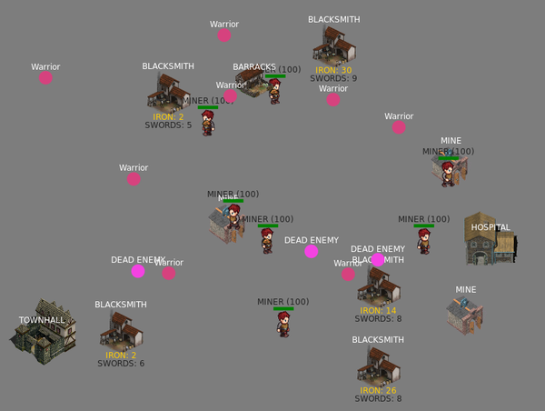

# Medieval life simulator

Simulate a medieval village in your browser!

[](./screenshot.png)

Feel free to add anything you want. Just expand this village by creating new buildings, characters, etc. in the [scripts/](./scripts/) directory and have fun! Please write scripts using the [p5.js](https://p5js.org/reference/) library.

Almost all [pull requests](https://github.com/TomaszWychocki/Medieval-life-simulator/pulls) will be accepted.

## Running

1. Clone this repository (or a [fork](https://github.com/TomaszWychocki/Medieval-life-simulator/fork) of it)
2. Install http-server for node.js:

```
npm i -g http-server
```

3. Go to repository directory
4. Run server and follow instructions in console

```
http-server
```

## Game Instructions:

 - press 'b' to toggle block of statistics in upper left corner (enabled by default)
 - press 'm' to toggle mute (sounds are enabled by default)